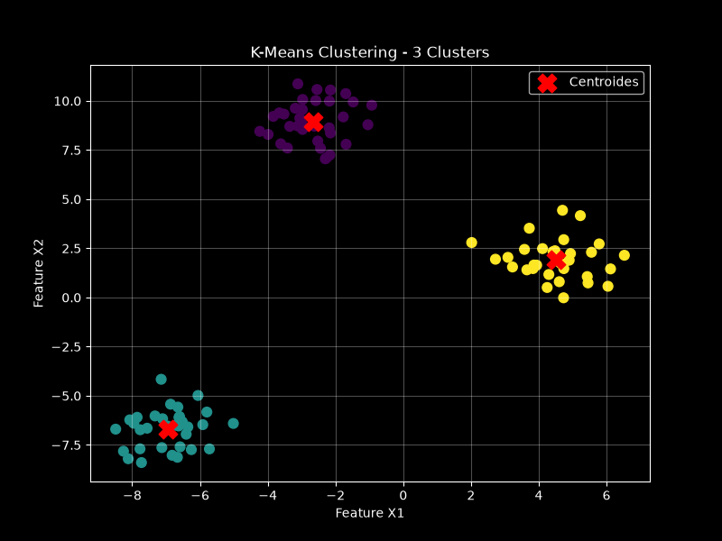

# K-Means Clustering Study

Projeto de estudo de **Machine Learning não supervisionado** utilizando o algoritmo **K-Means** para identificar agrupamentos em dados sintéticos.

## Objetivo

Demonstrar, de forma prática e visual, o fluxo básico de um projeto de clustering:

- geração de dados sintéticos;
- treinamento do modelo K-Means;
- identificação de 3 clusters;
- cálculo dos centroides;
- avaliação com Silhouette Score;
- visualização gráfica dos grupos e centroides.

## Resultado

O experimento utiliza **100 amostras sintéticas** e **3 clusters**, com `random_state=42` para garantir reprodutibilidade.

**Silhouette Score obtido: ~0,847**

Esse valor indica uma boa separação entre os grupos para este conjunto de dados sintético.

## Visualização



Os pontos representam as amostras agrupadas pelo K-Means e os marcadores **X vermelhos** representam os centroides encontrados pelo modelo.

## Tecnologias

- Python
- NumPy
- Matplotlib
- scikit-learn
- Jupyter
- Git / GitHub

## Estrutura do projeto

```text
kmeans-clustering-study/
├── outputs/
│   └── dados_sinteticos.png
├── src/
│   ├── teste.py
│   └── teste.png
├── .gitignore
├── README.md
└── requirements.txt
Como executar
Crie e ative um ambiente virtual e instale as dependências:
python3 -m venv .venv
source .venv/bin/activate
pip install -r requirements.txt
Depois execute:
python src/teste.py
Conceitos demonstrados
K-Means
Algoritmo de aprendizado não supervisionado que divide os dados em grupos com base na proximidade em relação aos centroides.
Centroides
Representam o centro de cada cluster.
Inércia
Mede a soma das distâncias quadráticas entre os pontos e seus respectivos centroides.
Silhouette Score
Métrica entre -1 e 1 usada para avaliar a qualidade da separação dos clusters.
Próximas evoluções
comparar diferentes valores de K;
implementar Elbow Method;
adicionar métricas automatizadas;
criar visualizações animadas do processo de convergência;
aplicar o pipeline a dados reais.
Autor: Constâncio Júnior
Projeto desenvolvido para estudo e portfólio em Engenharia de Dados, Ciência de Dados e Machine Learning.
